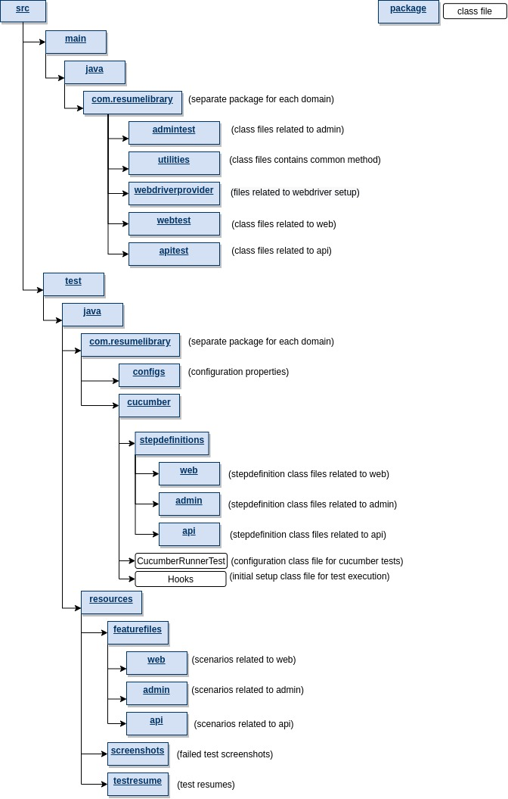

# README #

## What is this repository for? ###

Selenium tests using Cucumber BDD + TestNG approach to cover WEB, ADMIN, API on Resume-Library platform

## How do I get set up? ###

* Clone the repo into your machine
  
        git clone git@bitbucket.org:resumelibrary/rl-selenium-tests.git
  
### Configuration
  * Install Intellij IDEA Community Edition
  * Go to pom.xml and click sync icon to install all the necessary packages  

#### Install maven
* Please refer for any help in Maven installation
* http://maven.apache.org/guides/getting-started/maven-in-five-minutes.html
* http://www.tutorialspoint.com/maven/maven_environment_setup.htm
    
        sudo apt install maven
        mvn -version
    
#### Install java
* Please refer for any help in Java installation
* https://openjdk.java.net/install/
    
        sudo apt install default-jre
        java -version
    
        sudo apt install default-jdk
        javac -version
#### Set path in the .bashrc file

        nano ~/.bashrc
  
#### Add the below lines into .bashrc file (make sure you are adding correct version)

        JAVA_HOME="/usr/lib/jvm/java-8-openjdk-amd64"
        export JAVA_HOME
        export PATH=$PATH:$JAVA_HOME/bin

        M2_HOME="/usr/share/maven/apache-maven-3.6.0"
        export M2_HOME
        export PATH=$PATH:$M2_HOME/bin

#### To make sure you've set up correctly, type the below in the terminal

        echo $JAVA_HOME      
        you will get back 
        /usr/lib/jvm/java-8-openjdk-amd64

        echo $M2_HOME
        you will get back
        /usr/share/maven/apache-maven-3.6.0        

## Project structure    

## Implementation

### Cucumber Gherkin

Gherkin uses a set of special [keywords.](https://cucumber.io/docs/gherkin/reference/#keywords) to give structure and meaning to executable specifications. Each keyword is translated to many spoken languages; in this reference we’ll use English.

Most lines in a Gherkin document star with one of the [keywords.](https://cucumber.io/docs/gherkin/reference/#keywords). e.g.,

    Scenario: Login in as an existing Candidate
      Given   I login as a candidate
      Then    I should be on "My Account" page
      And     I should see text "Hi Resume-Library"
      And     I should see text "Recently Applied"

### Page Object Pattern using Selenium PageFactory

PageFactory is used to Initialize Elements of a Page class without having to use ‘FindElement‘ or ‘FindElements‘. Annotations can be used to supply descriptive names of target objects to improve code readability.
  
      @FindBy(id = "alliance-partners-btn")
      WebElement AlliancePartners;

The elements are initialised with:

       PageFactory.initElements(driver,this);

in the WebDriverProvider() in WebDriverProvider.java

### Screenshots on Failure

* Capture Screenshot when there is a test failure.
* getScreenshot() in Utility.java is used to indicate driver to take a screenshot and store it in src/test/java/resources/screenshots directory.

### Reporting
#### Maven surefire report
* index.html gets generated after the test completion. We can find that in "target/surefire-reports" folder
#### Extended report
* index.html gets generated after the test completion. We can find that in "target/extended-reports" folder

## How it works

### Docker compose
see docker-compose.yml

      container_name: standalone-chrome
      network_mode: bridge
      ports:
      - '4444:4444'
Chrome container: http://localhost:4444/wd/hub

    container_name: standalone-firefox
    network_mode: bridge
    ports:
    - '4445:4444'
Firefox container: http://localhost:4445/wd/hub

Once the container is up, it will run tests inside the container

### Selenium
There are two dependencies in the build file to allow us to automate the browser.

The required Selenium Libraries for interacting with a browser:

    org.seleniumhq.selenium:selenium-api
and webdrivermanager for managing drivers which are required by Selenium:

    io.github.bonigarcia:webdrivermanager
with these combined you can launch and perform actions on specified browsers.

WebDriverProvider.java specifies the functions for setting up drivers

### TestNG

TestNG is the testing framework used for running, multithreading, parameterising etc. the tests. The TestNG dependency in the build file adds all the libraries needed.

      org.testng:testng
Every test will use the TestNG @Before and @After annotations for the driver setup and teardown as the test classes themselves are child classes of WebDriverProvider.java

## How to run tests

       ./selenium.sh Regression

Regression is the tag name specified in the feature file      

## Contribution guidelines

### Writing tests
  * Create a new branch and write your tests
  * Push your changes to remote and create pull requests

### Code review
  * Check if the tests has enough coverage
  * Check the code and make sure its simple and easy to understand
  * Approve the pull requests